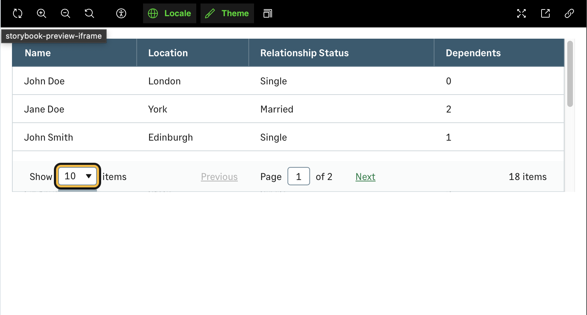
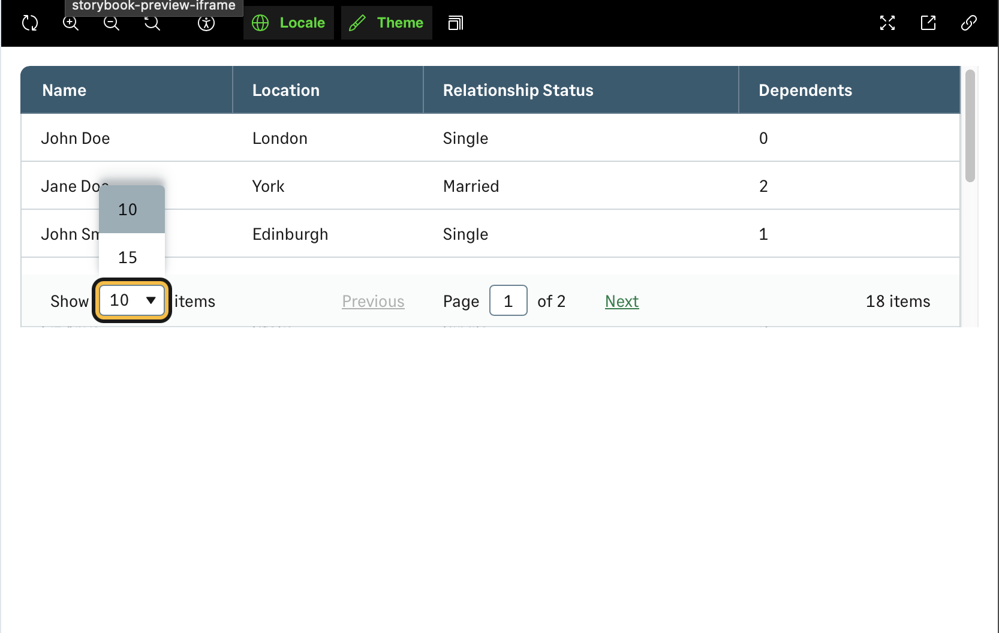
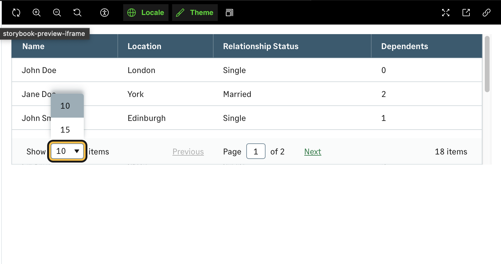
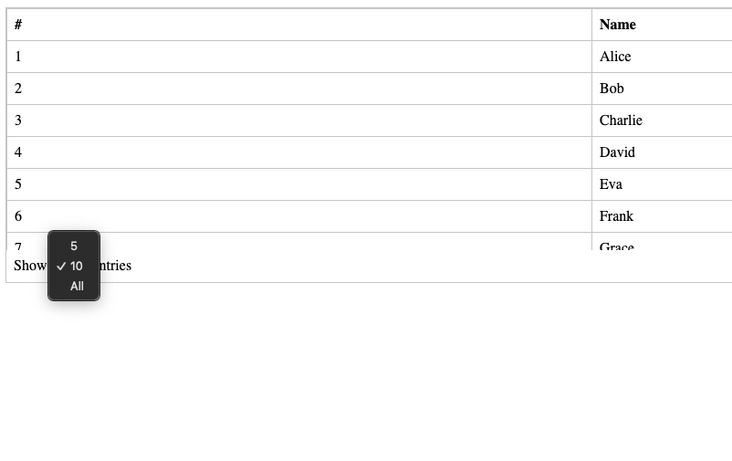
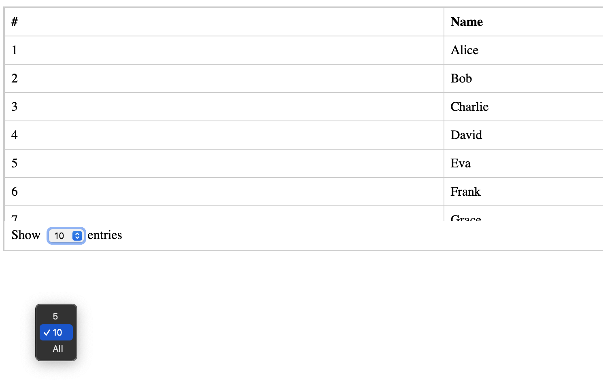

# FE-6669

## The Problem

You have a FlatTable inside a Box with a height of `220px`. The FlatTable will overflow because its height is greater than the height of the box. When the Select list for `Show Number of Items` is opened in Pager, it cannot be viewed as the overflow has been cut off from the Box/FlatTable. This issue is only present in **Firefox** and **Safari**. **Chrome** works as expected and shows the SelectList.

Screenshot of the bug in Safari.

---

## Breakdown of Debug Findings

I debugged this using using Storybook (Flat Table &rarr; With Sticky Footer) on localhost, StackBlitz using the same code as the Storybook example, I had to create a version that would run on Safari, as StackBlitz does not run on Safari. For this I created a Vite app using the same code Storybook and StackBlitz. I also created a CodePen example using just HTML and CSS to test how this functionality works outside of Carbon. [The HTML CodePen example](https://codepen.io/danieldipper/pen/gbbYjga)

- **Chrome**: Works as it should.
- **Firefox**: 
  - Works completely fine on StackBlitz and the HTML CodePen version.
  - Bug is present in Storybook and the Vite app.
- **Safari**:
  - Unable to test on StackBlitz (incompatible) but the HTML version in CodePen also has a visual bug.
  - Bug is present in Storybook or the Vite app.

  It appears that the source of the bug is due to how aggressively Firefox and Safari both cut elements that overflow the Y axis. Chrome on the other hand is quite forgiving in this sense and will let the element render, rather than be cut off.

## Potential Solutions

### Enable Portal

Enabling the portal by **removing the `disablePortal` prop** from the SelectList fixes the issue in **Safari** and **Firefox**.  
I surmise this is because the SelectList is now rendered in an element outside of the DOM hierarchy where FlatTable and Box are. With this fix, we may have an issue with screen reader behaviour and this will require further investigation.

### Overflow Visible Fix

Applying `overflow: visible !important;` to the FlatTableWrapper also fixes the issue, **but** it breaks the **stickyFooter** functionality of the FlatTable. This fix introduces more problems than it fixes.

### Removing "`position: fixed` in Popover styles" Fix

Removing the `position: fixed` styling from the Popover component styling ensures that the Select dropdown is rendered 
above the Select component, but this covers some of the data in the table. 

This is how this fix would look in Safari. 

### Allow "`listPlacement`" Prop on Pager

We could allow the `listPlacement` prop in Select to be exposed to Pager. This would allow consumers the flexibility to choose which way the SelectList opens in situations like this. This would also pose the same issue as the removal of `position: fixed` solution. The list would appear over the top of data presented in the table body.

This is a screenshot of how this would look on Safari

---

## Additional Notes

When creating a CodePen example using plain HTML and CSS:

- **Chrome**: Works as expected — the Select dropdown appears beside the Select element. 
- **Safari**: The Select dropdown appears at the bottom of the calculated overflow height. 
