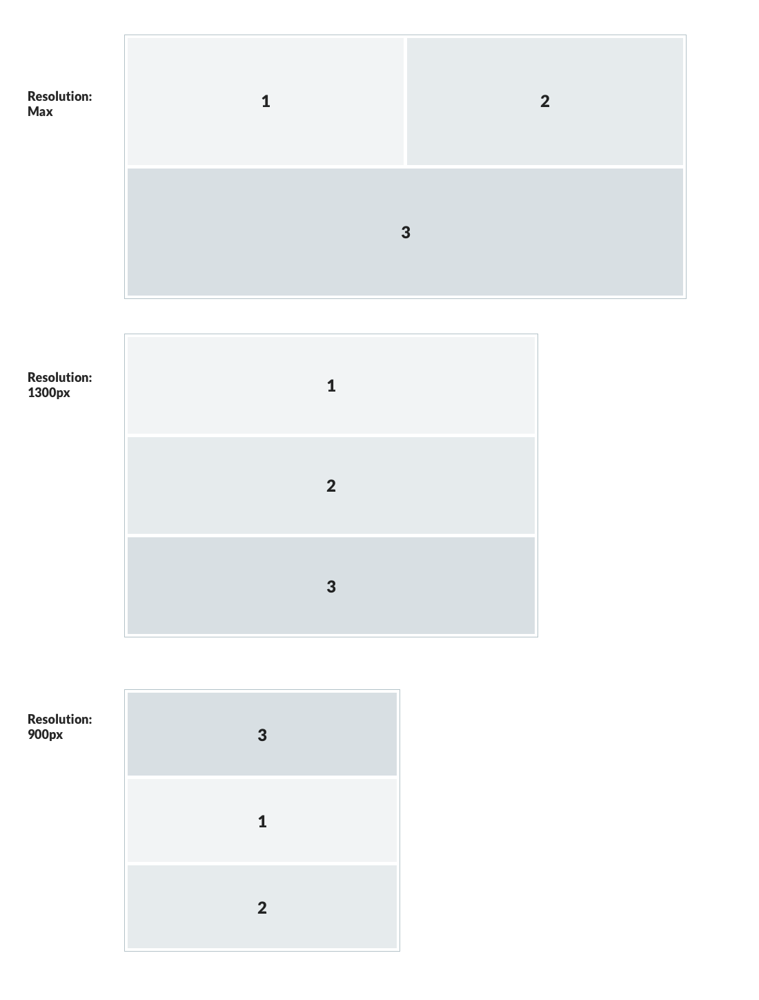

- Start Date: 2019-12-11

# Table of contents

- [Summary](#summary)
- [Motivation](#motivation)
- [Detailed design](#detailed-design)
  - [GridContainer](#grid-container)
  - [GridItem](#grid-item)
  - [Code example](#code-example)
- [CSS Grid Layout](#css-grid-layout)
- [Alternatives considered](#alternatives-considered)
  - [CSS Flexbox](#css-flexbox)
  - [CSS Framework (Bootstrap or Foundation)](#css-framework-bootstrap-or-foundation)
- [Comparison methodology](#comparison-methodology)
- [Adoption strategy](#adoption-strategy)
- [How we teach this](#how-we-teach-this)

# Summary

A responsive grid system is a layout component that provides guidance on how components should be positioned within a user interface, adapting to screen size and orientation. We, the Carbon team, would like to implement the grid system designed by Sage UI designers.

# Motivation

The grid system is intended to solve a number of problems that are often experienced when developing complex web applications:
1. CSS floats are not well suited to application layout.
1. Layouts that use a combination of tables, JavaScript and floated elements are often brittle and can behave unexpectedly.
1. Fixed layouts that behave predictably cannot take advantage of the entire screen real estate.

A well designed grid system will be:
1. Consistent, which helps users navigate and understand where information will be found.
1. Responsive, which gives users a predictable experience across multiple devices with different screen sizes.
1. Adaptable, enabling new design themes to be introduced more quickly as designs evolve over time.

# Detailed design

The Grid component is designed to provide:
1. A common language for designers and developers to use when discussing layout.
1. Structure and responsive layout without a developer writing additional CSS.
1. No fixed breakpoints; responsive adjustments can be customised at a [`GridItem`](#GridItem) level.
1. Position and width calculated dynamically.

## `GridContainer`
To avoid introducing a breaking change, and to give developers the freedom to choose whether or not to use the component, a new [`GridContainer`](#GridContainer) component will be developed, which can be used as a child of the [`AppWrapper`](https://github.com/Sage/carbon/tree/master/src/components/app-wrapper). As the parent wrapper component for all [`GridItems`](#GridItem) and the element on which the `display: grid` property is set, the [`GridContainer`](#GridContainer) will define 12 equal-width columns, including external margins and internal gutters. 
> 12 is divisible into 12, 6, 4, 3, 2 or 1 equal-width columns, giving maximum possible flexibility for a layout. 

By dividing the available space into predictably-sized modules (both vertically and horizontally), complex layouts that don't have fixed dimensions can be controlled and components can be positioned allowing a clean separation of content and style. 
### Max Width Flexibility
The container for a [`GridContainer`](#GridContainer) could specify either 100% or a fixed pixel width. By default the [`GridContainer`](#GridContainer) will respect the boundaries of this outer element, so if an outer element has a `max-width: 1280px`, the [`GridContainer`](#GridContainer) including it's margins and gutters will be based on that size.

### Margins
Margins for the [`GridContainer`](#GridContainer) are set automatically in the CSS, following the values in this table.

| Breakpoints                | Device Type  | Margins |
|----------------------------|--------------|---------|
| Extra Small (320 to 599px) | Smart Phones | 16px    |
| Small (600 to 959px)       | Portrait Tablets | 24px |
| Medium (960 to 1259px) | Landscape Tablets & Low-Res Laptops | 32px |
| Large (1260 to 1920px) | High-Res Laptops & Monitors | 40px |
| Extra Large (1921px and above) | Ultra High-Res Monitors |40px |


## `GridItem`
The child of a [`GridContainer`](#GridContainer) is a [`GridItem`](#GridItem), which can have a set of breakpoints applied that are used to control how each [`GridItem`](#GridItem) responds at given widths.

### `GridItem` features
1. Can be defined at any width between 1 and 12, each unit corresponding to a column of the [`GridContainer`](#GridContainer).
1. Unlimited breakpoints provide dynamic adjustment at any viewport width.
1. Gutters are calculated automatically based on a the number of `GridItems`.
1. Can be re-ordered on the page by viewport dimensions.
1. Can be styled to look like a container.
1. Can be passed a range of values for padding.

### Gutters
Gutters for the [`GridItem`](#GridItem) are set automatically in the CSS, following the values in this table.

| Breakpoints                | Device Type  | Gutters |
|----------------------------|--------------|---------|
| Extra Small (320 to 599px) | Smart Phones | 16px    |
| Small (600 to 959px)       | Portrait Tablets | 16px |
| Medium (960 to 1259px) | Landscape Tablets & Low-Res Laptops | 24px |
| Large (1260 to 1920px) | High-Res Laptops & Monitors | 24px |
| Extra Large (1921px and above) | Ultra High-Res Monitors |40px |

## Code example:
Below is an example of how a Grid could be included as a component and used to implement the [`proposed solution used in the CSS comparison`](#comparison-methodology).
```js
import React from "react";
import { ThemeProvider } from "styled-components";
import { mintTheme } from "carbon-react/lib/style/themes";
import "carbon-react/lib/utils/css";
import { startRouter } from "carbon-react/lib/utils/router";
import AppWrapper from "carbon-react/lib/components/app-wrapper";
import { GridContainer, GridItem } from "./components/grid";

const App = () => {
  const item1_900 = {
    maxWidth: 900,
    unitType: 'px',
    colStart: 1,
    colEnd: 9,
    rowStart: 2,
    rowEnd: 2,
    alignSelf: 'stretch',
    justifySelf: 'stretch'
  };
  const item1_1300 = {
    maxWidth: 1300,
    unitType: 'px',
    colStart: 1,
    colEnd: 13,
    rowStart: 1,
    rowEnd: 1,
    alignSelf: 'stretch',
    justifySelf: 'stretch'  
  };
  const item1_1500 = {
    maxWidth: 1500,
    unitType: 'px',
    colStart: 1,
    colEnd: 7,
    rowStart: 1,
    rowEnd: 1,
    alignSelf: 'stretch',
    justifySelf: 'stretch'
  }
  const responsiveItem1Settings = [
    item1_1300,
    item1_900,
    item1_1500
  ];

  const item2_900 = {
    maxWidth: 900,
    unitType: 'px',
    colStart: 1,
    colEnd: 9,
    rowStart: 3,
    rowEnd: 3,
    alignSelf: 'stretch',
    justifySelf: 'stretch'
  };
  const item2_1300 = {
    maxWidth: 1300,
    unitType: 'px',
    colStart: 1,
    colEnd: 13,
    rowStart: 2,
    rowEnd: 2,
    alignSelf: 'stretch',
    justifySelf: 'stretch'
  };
  const item2_1500 = {
    maxWidth: 1500,
    unitType: 'px',
    colStart: 7,
    colEnd: 13,
    rowStart: 1,
    rowEnd: 1,
    alignSelf: 'stretch',
    justifySelf: 'stretch'
  };
  const responsiveItem2Settings = [
    item2_1300,   
    item2_900,
    item2_1500
  ];

  const item3_900 = {
    maxWidth: 900,
    unitType: 'px',
    colStart: 1,
    colEnd: 9,
    rowStart: 1,
    rowEnd: 1,
    alignSelf: 'stretch',
    justifySelf: 'stretch'
  };
  const item3_1300 = {
    maxWidth: 1300,
    unitType: 'px',
    colStart: 1,
    colEnd: 13,
    rowStart: 3,
    rowEnd: 3,
    alignSelf: 'stretch',
    justifySelf: 'stretch'
  };
  const item3_1500 = {
    maxWidth: 1500,
    unitType: 'px',
    colStart: 1,
    colEnd: 13,
    rowStart: 2,
    rowEnd: 2,
    alignSelf: 'stretch',
    justifySelf: 'stretch'
  };
  const responsiveItem3Settings = [
    item3_1300,
    item3_900,
    item3_1500
  ];

  return (
    <ThemeProvider theme={mintTheme}>
      <AppWrapper>
        <GridContainer>
          <GridItem 
            responsiveSettings={responsiveItem1Settings} 
          >
            cell 1
          </GridItem>
          <GridItem 
            responsiveSettings={responsiveItem2Settings} 
          >
            cell 2
          </GridItem>
          <GridItem 
            responsiveSettings={responsiveItem3Settings} 
          >
            cell 3
          </GridItem>
        </GridContainer>
      </AppWrapper>
    </ThemeProvider>
  );
};
```
The [GridItem](#GridItem) component could be constructed with default props.

```js
GridItem.defaultProps = {
  gridColumnStart: 1, 
  gridColumnEnd: 13,
  gridRowStart: 'auto',
  gridRowEnd: 'auto'
}

export default GridItem;
```

This is a code fragment showing how a Styled Component would use defaults or props overides
```js
return css`
    margin: 0;
    grid-column-start: ${gridColumnStart};
    grid-column-end: ${gridColumnEnd};
    grid-row-start: ${gridRowStart};
    grid-row-end: ${gridRowEnd};
    @media screen and (max-width: ${maxWidth+maxWidthUnits}) {
      align-self: ${alignSelf};
      justify-self: ${justifySelf};
      grid-column-start: ${colStart};
      grid-column-end: ${colEnd};
      grid-row-start: ${rowStart};
      grid-row-end: ${rowEnd};
    }`
```

## CSS Grid Layout
[`CSS Grid`](https://www.w3.org/TR/css-grid-1/) Layout is a truly two-dimensional grid, allowing us to specify dimensions of rows and columns, and control where we position components within the grid.

### Advantages
1. Provides a simple way to ensure spacing is always correct.
1. Padding can be adjusted by viewport width.
1. Layout can be controlled in two dimensions on the defined grid.
1. No need to have width calculated by CSS, as grid spaces handle width.

### Disadvantages
Considering that a grid layout is created to serve the same content on different-width viewports, it comes with a few disadvantages:

1. If two [`GridItems`](#GridItem) occupy the same space, one is hidden.
1. All the data is served to all viewports, regardless of how much real estate is available and how much content is actually displayed, adversely affecting page load speeds.
1. Start and end positions are derived from supplied units and offset properties. 
1. To change one [`GridItem`](#GridItem) would also require adjustment of all other related [`GridItems`](#GridItem) to avoid overlapping and colliding components.
1. The grid position of a component may be different to the DOM order, causing flow and context discrepancies when using screen readers.
1. Users who navigate with a keyboard may experience unexpected sequences when tabbing through components. 

> The recommendation is that grid ordering and placement is used only for visual (not logical) reordering of content. 
For an explanation of what this means in practice, see the [Mozilla CSS Grid Layout](https://developer.mozilla.org/en-US/docs/Web/CSS/CSS_Grid_Layout/CSS_Grid_Layout_and_Accessibility#Visual_not_logical_re-ordering).


# Alternatives considered

## CSS Flexbox
[`CSS Flexbox`](https://www.w3.org/TR/css-flexbox/) is designed for layout in one dimension (either a row or a column). Although it does support wrapping, the second-dimension positioning of components cannot be controlled (since the components are just being pushed along a single axis until they wrap).

### Advantages
1. If two [`GridItems`](#GridItem) get the same order, you will still see both.
1. You can pass a single value for number of units width required.
1. Order will work as long as numbers are before/after.
1. Move content with just an adjustment to single GridItem (i.e changes from 6 to 12 units and will auto push next column down)

### Disadvantages
1. Overlapping modules within a Flexbox layout requires creative use of negative margins, transforms, and/or absolute positioning.
1. Also has the same accessibility issues around screen readers and keyboard navigation as CSS Grid.

## CSS Framework (Bootstrap or Foundation)
A CSS framework is a library of predefined CSS styles that are ready to use out-of-the-box. The best known of these are:

[Bootstrap](https://getbootstrap.com/)  
[Foundation](https://foundation.zurb.com/)

### Advantages
1. Comprehensive documentation.
1. Community support.
1. Potentially quicker development speed.

### Disadvantages
1. Including a CSS framework in Carbon (a library built with [Styled Components](https://www.styled-components.com/) at its heart) would require generating a special `StyledComponent` at a global level to enable CSS resets and base stylesheets, which may cause conflicts with Carbon's Base Theme. There would be other disadvantages too:
1. Difficulty in overriding the framework code.
1. Bloated codebase that attempts to solve compatibility and support issues we don't need.
1. More complex markup.

# Comparison Methodology
In order to evaluate the competing CSS styling options (Grid v Flexbox) a simple layout concept was proposed and a solution developed in each approach under consideration.
## Layout


### CSS Grid
```html
<h1>CSS Grid</h1>
<div class="GridContainer">
  <div class="GridItem item1" data-start="1" data-end="7" data-row="1">1</div>
  <div class="GridItem item2" data-start="7" data-end="13" data-row="1">2</div>
  <div class="GridItem item3" data-start="1" data-end="13" data-row="1">3</div>
</div>

<div class="GridContainer">
  <div class="GridItem item1" data-start="1" data-end="13" data-row="1">1</div>
  <div class="GridItem item2" data-start="1" data-end="13" data-row="2">2</div>
  <div class="GridItem item3" data-start="1" data-end="13" data-row="3">3</div>
</div>

<div class="GridContainer">
  <div class="GridItem item1" data-start="1" data-end="13" data-row="2">1</div>
  <div class="GridItem item2" data-start="1" data-end="13" data-row="3">2</div>
  <div class="GridItem item3" data-start="1" data-end="13" data-row="1">3</div>
</div>
```
#### CSS (abridged)
```css
.GridContainer {
  display: grid;
  grid-gap: 24px;
  grid-template-columns: repeat(12, 1fr);
  width: 100%;
}

.GridItem {
  box-sizing: border-box;
  font-size: 14px;
  line-height: 21px;
  padding: 20px;
  
  &[data-start="1"] { grid-column-start: 1; }
  &[data-start="2"] { grid-column-start: 2; }
  &[data-start="3"] { grid-column-start: 3; }

  ...

  &[data-start="10"] { grid-column-start: 10; }
  &[data-start="11"] { grid-column-start: 11; }
  &[data-end="2"] { grid-column-end: 2; }
  &[data-end="3"] { grid-column-end: 3; }
  &[data-end="4"] { grid-column-end: 4; }

  ...

  &[data-end="12"] { grid-column-end: 12; }
  &[data-end="13"] { grid-column-end: 13; }
  
  &[data-row="1"] { grid-row: 1; }
  &[data-row="2"] { grid-row: 2; }
  &[data-row="3"] { grid-row: 3; }
}
```
### CSS Flexbox
```html
<h1>Flexbox</h1>
<div class="GridContainer">
  <div class="GridItem item1" data-units="6" data-order="1">1</div>
  <div class="GridItem item2" data-units="6" data-order="2">2</div>
  <div class="GridItem item3" data-units="12" data-order="3">3</div>
</div>

<hr/>

<div class="GridContainer">
  <div class="GridItem item1" data-units="12" data-order="1">1</div>
  <div class="GridItem item2" data-units="12" data-order="2">2</div>
  <div class="GridItem item3" data-units="12" data-order="3">3</div>
</div>

<hr/>

<div class="GridContainer">
  <div class="GridItem item1" data-units="12" data-order="1">1</div>
  <div class="GridItem item2" data-units="12" data-order="1">2</div>
  <div class="GridItem item3" data-units="12" data-order="1">3</div>
</div>
```
#### CSS (abridged)
```css
$grid: 8.3333333333%;

.GridContainer {
  align-items: flex-start;
  box-sizing: border-box;
  display: flex;
  flex-wrap: wrap;
  justify-content: space-between;
  width: 100%;
  column-gap: 24px;
}

.GridItem {
  box-sizing: border-box;
  font-size: 14px;
  line-height: 21px;
  margin-bottom: 24px;
  padding: 20px;
  
  &[data-units="2"]  { width: calc(#{$grid * 2} - 12px); }
  &[data-units="3"]  { width: calc(#{$grid * 3} - 12px); }
  &[data-units="4"]  { width: calc(#{$grid * 4} - 12px); }

  ...
   
  &[data-units="11"]  { width: calc(#{$grid * 11} - 12px); }
  &[data-units="12"] { width: calc(#{$grid * 12}); }

  &[data-order="1"] { order: 1; }
  &[data-order="2"] { order: 2; }
  &[data-order="3"] { order: 3; }

  &.container {
    background: white;
    border: 1px solid #CCD6DA;
  }
}
```
CSS Grid was adjudged the clear winner due to it's enhanced flexibility and control.
# Adoption strategy

This is a new component and as such would not change the existing API, so it is not considered to be a breaking change. The new [`GridContainer`](#GridContainer) can be used at a page level to wrap any group of components. See the detailed design above for a code example.

# How we teach this
Storybook and Fixtures testbed examples should be developed alongside the new component, demonstrating ways to implement the new layout.